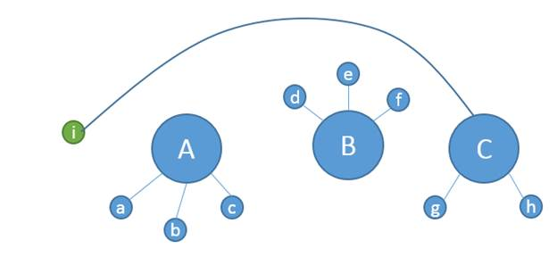
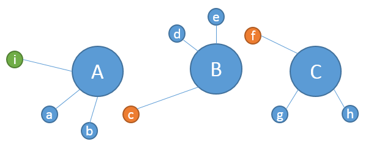

# FIRST Event Planner

Demo [Video: mp4 (24mb)](http://lovettsoftware.com/Videos/FIRST%20Event%20Planner.mp4)

I received an email from a friend asking for help figuring out a fun math problem.  He works for [FIRST](http://www.usfirst.org/) and the problem is figuring out how to match up over 400 teams in Washington State with 5 separate event locations, minimizing the driving distance for each of those teams.  Each event was happening on the same day, and each team gets to compete at only one of these events.

So I quickly cranked out a nice little [Silverlight Application](http://lovettsoftware.com/downloads/first/firsteventplanner.html) to do the job.  And I hooked up to the [BING Mapping API](http://www.microsoft.com/maps/developers/web.aspx) to calculate the actual driving distances from each team to each event location.  Silverlight and BING worked beautifully together.  So far so good, but now for the hard part.  How do you calculate the optimal assignment of teams to events that results in minimal total driving distance?  I hacked out a brute force solution that first assigned every team to their closest venue, but then there were additional constraints that got more interesting.  Each event has a minimum and maximum capacity, so if an event was over populated, some teams had to move to the second or third closest venue.  This wasn't too hard to code, but I quickly realized, the solution I was getting was not necessarily the best.  For example, in the diagram below, let's say the maximum capacity for each event is 3 teams, which means team "i" needs drive all the way to "C".  Clearly this is silly.

 
It is better to move "c" to "B" and "f" to "C", making room for "i" to join "A", like this:

 
But this is a tricky "ripple" effect that is hard to find programmatically without having to essentially search all combinations of teams to events, but then I quickly realized it would take about 100 years to execute that kind of exhaustive search on my machine because 400 factorial is a large number.

So this is when I contacted Microsoft Research.  [Lev Nachmanson](http://research.microsoft.com/en-us/um/people/levnach/) works there and is a good friend of mine and a powerful magician when it comes to mathematics.  So I presented the problem to him, and he said he'd think about it.

In a short while I got an email back saying he had a solution.  He explained it to me over the phone, I implemented it, and it worked, finding the solution in less than a second.  I was very impressed, but I also a bit skeptical.  I couldn't believe it could be so simple.  I went to his office to get a better understanding of how it worked.

This is how he explained it to me. The global task is to drive to the minimum the sum of the distances from teams to the events they are assigned to. To initialize a solution assign each team to their closest event, but then think of the remaining optimization problem as a type of traffic flow problem.  We will be shifting the teams between the events, so we need to consider a graph for doing this. The edges of this graph are AB, AC, and BC. (It is called a complete graph.) For example, above we moved "c" along edge AB, "f" along BC and "i" along AC. To find a solution we need to consider all paths on the complete graph that don't repeat an edge. A path can be a cycle, like ABCA, but every edge in it should appear at most once.

To run one iteration, take a path as described above, then take the first edge of the path and shift a team along it such that shifting it along this edge "makes the least damage". Here the total sum can even grow. Take the second edge and do the same, and do it for every edge of the path. When we are done with the path, look at the total sum. If we are lucky and it went down, we accept the move, otherwise, we discard it. When no path gives us a gain we are done!

Then how many possible paths do we have? Well in this case with 3 events there is AB, AC, BA, BC, CA, CB, ABC, ACB, BAC, BCA, CBA, CAB  plus all the cyclic versions of these: ABA, ACA, BAB, BCB, CAC, CBC, ABCA, ACBA, BACB, BCAB, CBAC, CABC, a total of 24. It is not a huge amount of paths. The last thing to do for running the algorithm fast is to know how efficiently to find a team which can be shifted along an edge with the minimal damage. The best data structure for this is a priority queue.

The end result was that on my desktop machine I could use this algorithm to find the optimal solution in sub-second times, which is fantastic.  Super thanks to Lev!   I just love it when a nice elegant algorithm makes software work really well.  As I like to say, "there's genius in simplicity".
