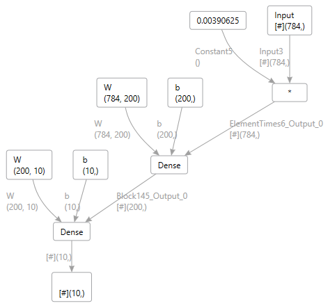

# Having fun with ELL

[ELL](https://github.com/Microsoft/ELL/) is a new Open Source library from Microsoft Research.  I'm having lots of fun working on it and learning all about Convolutional Neural Networks.  The first time you train one and try it out it definitely feels like magic.  How can a bunch of numbers correctly classify the type of object in a photo?  Granted we're talking millions of numbers, so it's not that magical, but it is still fun.

Now, of course, I have to combine this with my love of [DGML graphs](http://lovettsoftware.com/wordpress/?p=30). So in this post I will outline how I've used ELL to execute neural networks trained on the MNist dataset.  MNist is a classic benchmark for neural networks and it provides a dataset for "hand written digits".  This dataset is small since each image is only 28×28 pixels, which makes for a great "first time developer experience" with neural networks, since you don't have to wait for terabytes of images to be downloaded!

For example, here's one of their test images which contains a hand written digit "8":


It turns out the [Microsoft CNTK library](https://github.com/Microsoft/CNTK) is an excellent library for training  Neural networks and there is a CNTK sample that can be used to train an MNist model.  See [install_mnist.py](https://github.com/Microsoft/CNTK/blob/c9b03e49b3e19fca448ff960acda76417ab4dbe8/Examples/Image/DataSets/MNIST/install_mnist.py).  After you run that you will have the MNist dataset and then you can run SimpleMNIST.py to train a CNTK model on that dataset.   On my machine I get a file named **mnist.cntk** which is about 640kb.

So the next thing I want to do is run this on a Raspberry Pi, so I used the ELL library to do that.  If you follow the [Getting Started](https://microsoft.github.io/ELL/tutorials/Getting-started-with-image-classification-on-the-Raspberry-Pi/) tutorial you will see how easy it is to build ELL, import a model from CNTK and build a cross-compiled module that will run on the Raspberry Pi.  So in my case I simply do this (after building the ELL repo):
```
python d:\git\ell\ell\tools\importers\CNTK\cntk_import.py mnist.cntk
```
This gives me an "mnist.ell" model, so what is inside this model? You can use the ELL print tool with -dgml and get this picture:



Of course, this is a very simple neural network.  Try the DGML graph on some of the more complex deep neural networks.   You can then compile this model using the ELL model compiler:

```
python d:\git\ell\ell\tools\wrap\wrap.py mnist.ell --target pi3
```

This gives me a 'pi3' folder already setup with CMakeLists.txt for building on the pi.  You can also copy Demo.py and DemoHelpers.py from ELL\tools\utilities\pythonlibs to get a quick start in using this python module.  Once on the pi do the using cmake build thing outlined in the ELL tutorials, and then we can test it out.
To test it out we can run this python script:

```python
import cv2
import numpy as np
import sys
sys.path += [ "d:/Temp/MNist/host" ]
sys.path += [ "d:/Temp/MNist/host/build" ]
sys.path += [ "d:/Temp/MNist/host/build/Release" ]
import mnist
import requests
r = requests.get("http://www.lovettsoftware.com/images/eight.jpg")
nparr = np.fromstring(r.content, np.uint8)
image = cv2.imdecode(nparr, cv2.IMREAD_COLOR)
plt.imshow(image)
gray = cv2.cvtColor(image,cv2.COLOR_RGB2GRAY)
output = mnist.predict(gray.ravel())
result = np.array(output)
print("Prediction={}".format(np.argmax(result)))
```

which prints the correct output, namely "8".
If you want to get adventurous you can run the ELL model over all the tests images in the MNist test dataset using this python code:

```python
import sys
import cv2
import numpy as np
sys.path.append("host")
sys.path.append("host/build")
sys.path.append("host/build/Release")
import mnist
input_shape = mnist.get_default_input_shape()
input_size = input_shape.rows * input_shape.columns
* input_shape.channels
output_shape = MNist.get_default_output_shape()
output_size = output_shape.rows * output_shape.columns
* output_shape.channels
nogui = False
failed = 0
total = 0
args = sys.argv[1:]
if len(args) == 1 and args[0] == "nogui":
    nogui = True
def getLabel(labels):
    a = labels.split(' ')
    if a[0] == 'labels':       
        for i in range(10):
            if a[i+1] == "1":
                return i
    return 0
 
def getImage(features):
    a = features.split(' ')
    data = []
    if a[0] == 'features':       
        for i in range(len(a) - 1):
            data.append(float(a[i+1]))
    return np.array(data).reshape((28,28))
 
def Test(index, line):
    global total, failed, output_buffer
    parts = line.split('|')
    passed = True
    if len(parts) == 3:
        labels = parts[1]
        features = parts[2]
        answer = getLabel(labels)
        image = getImage(features)
        if not nogui:
            cv2.imshow("test", image)
        output = mnist.predict(image.ravel())
        prediction = np.argmax(output)
        result = "passed"
        if prediction != answer:
            result = "failed"
            failed += 1
            passed= False
        total += 1
        print("%d: predicted %d, answer is %d, test %s"
             % (index, prediction, answer, result))
    return passed
 
def WaitForKey():
    key = cv2.waitKey(1) & 0xFF
    while key == 255:
        key = cv2.waitKey(1) & 0xFF
    return key
 
def RunTest(filename):
    global total, failed
    index = 1
    with open(filename) as f:
        for line in f.readlines():
            line = line.strip()
            passed = Test(index, line)
            index += 1
            if not nogui and not passed and WaitForKey() == 27:
                return
    print("")
 
    print("Total tests %d, failed = %d, pass rate = %f" % 
        (total, failed, (total - failed) / total))
 
RunTest("Test-28x28_cntk_text.txt") 
```
 
Then the output from this is:
```
Total tests 10000, failed = 259, pass rate = 0.974100
```

Lots 'o fun!